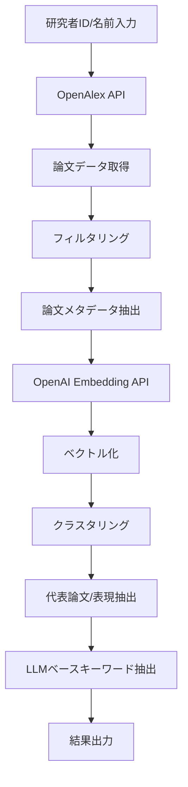

# Keyword Extractor Specification

## 概要

研究者の学術的専門性を表すキーワードを、論文データから自動的に抽出するシステム。OpenAlex APIから取得した論文データを基に、埋め込みベクトル化、クラスタリング、LLMベースの解析を組み合わせて、研究者の主要な研究テーマとキーワードを抽出する。

## 1. システムアーキテクチャ

### 1.1 全体フロー



### 1.2 主要コンポーネント

1. **Data Fetcher** - OpenAlex APIからのデータ取得
2. **Paper Filter** - 論文のフィルタリングと前処理
3. **Embedding Generator** - OpenAI APIによる埋め込み生成
4. **Clustering Engine** - クラスタリング処理
5. **Representative Extractor** - 代表的論文/表現の抽出
6. **Keyword Generator** - LLMベースのキーワード生成
7. **Result Formatter** - 出力フォーマット処理

## 2. データ取得仕様

### 2.1 OpenAlex API利用

#### エンドポイント
```
GET https://api.openalex.org/works
```

#### クエリパラメータ

| パラメータ | 説明 | 例 |
|-----------|------|-----|
| `filter` | フィルタ条件 | `authorships.author.id:A1234567890` |
| `publication_year` | 出版年フィルタ | `>2014` (直近10年) |
| `per_page` | ページあたり取得数 | `200` |
| `mailto` | Polite Pool利用 | `user@example.com` |

#### 取得フィールド

```python
{
    "id": "OpenAlex Work ID",
    "display_name": "論文タイトル",
    "abstract": "アブストラクト",
    "publication_year": 2024,
    "cited_by_count": 10,
    "primary_location": {
        "source": {
            "display_name": "ジャーナル名",
            "issn_l": "ISSN",
            "host_organization": "出版社"
        }
    },
    "authorships": [
        {
            "author": {"id": "A123", "display_name": "Author Name"},
            "author_position": "first",  # "first", "middle", "last"
            "is_corresponding": true
        }
    ],
    "topics": [
        {"id": "T123", "display_name": "Topic", "score": 0.95}
    ]
}
```

### 2.2 著者名からの検索

著者名が与えられた場合、まず著者検索を行う：

```
GET https://api.openalex.org/authors?search={author_name}
```

最も関連性の高い著者のIDを取得し、そのIDで論文を検索。

## 3. フィルタリング仕様

### 3.1 基本フィルタ

| フィルタ項目 | 条件 | デフォルト値 |
|-------------|------|-------------|
| 期間 | `publication_year >= current_year - years_back` | `years_back=10` |
| 著者位置 | `author_position in ['first', 'last']` | 第一著者または最終著者 |
| 最小引用数 | `cited_by_count >= min_citations` | `min_citations=0` |
| 論文タイプ | `type in ['article', 'review']` | 論文とレビューのみ |

### 3.2 設定可能パラメータ

```python
class FilterConfig:
    years_back: int = 10  # 遡る年数
    author_positions: List[str] = ['first', 'last']  # 著者位置
    min_citations: int = 0  # 最小引用数
    max_papers: int = 200  # 最大論文数
    paper_types: List[str] = ['article', 'review']  # 論文タイプ
```

## 4. 埋め込み生成仕様

### 4.1 OpenAI Embedding API

#### モデル
```python
model = "text-embedding-3-small"
dimensions = 1536  # デフォルトの次元数
```

#### 入力テキスト構成

各論文について、以下のフォーマットでテキストを構成：

```python
embedding_text = f"""
Title: {paper.title}
Abstract: {paper.abstract}
Topics: {', '.join(paper.topics)}
Journal: {paper.journal_name}
Year: {paper.publication_year}
"""
```

### 4.2 バッチ処理

効率化のため、複数論文をバッチで処理：

```python
batch_size = 20  # 一度に処理する論文数
```

## 5. クラスタリング仕様

### 5.1 クラスタリング手法

#### プライマリ手法: K-Means
```python
from sklearn.cluster import KMeans

n_clusters = min(int(np.sqrt(n_papers)), 10)  # クラスタ数の自動決定
kmeans = KMeans(
    n_clusters=n_clusters,
    random_state=42,
    n_init=10
)
```

#### オプション手法: HDBSCAN（密度ベース）
```python
import hdbscan

clusterer = hdbscan.HDBSCAN(
    min_cluster_size=3,
    min_samples=2,
    metric='euclidean',
    cluster_selection_method='eom'
)
```

### 5.2 クラスタ数の決定ロジック

```python
def determine_optimal_clusters(n_papers: int) -> int:
    """論文数に基づくクラスタ数の決定"""
    if n_papers < 10:
        return min(3, n_papers)
    elif n_papers < 30:
        return 5
    elif n_papers < 60:
        return 7
    else:
        return min(10, int(np.sqrt(n_papers)))
```

## 6. 代表的表現の抽出

### 6.1 クラスタ代表の選定戦略

#### Strategy 1: Medoid-based（推奨）
各クラスタで最も中心的な論文を選択：

```python
def find_medoid(cluster_embeddings, cluster_papers):
    """クラスタの medoid（最も中心的な点）を見つける"""
    centroid = np.mean(cluster_embeddings, axis=0)
    distances = np.linalg.norm(cluster_embeddings - centroid, axis=1)
    medoid_idx = np.argmin(distances)
    return cluster_papers[medoid_idx]
```

#### Strategy 2: Weighted Selection
引用数とcentroidへの距離を組み合わせた重み付け選択：

```python
def weighted_selection(cluster_papers, cluster_embeddings):
    """引用数と中心性を考慮した代表選択"""
    centroid = np.mean(cluster_embeddings, axis=0)
    distances = np.linalg.norm(cluster_embeddings - centroid, axis=1)

    # 距離スコア（0-1に正規化、近いほど高スコア）
    distance_scores = 1 - (distances - distances.min()) / (distances.max() - distances.min())

    # 引用スコア（対数スケール）
    citation_scores = np.log1p([p.cited_by_count for p in cluster_papers])
    citation_scores = citation_scores / citation_scores.max()

    # 重み付けスコア
    weights = 0.6 * distance_scores + 0.4 * citation_scores

    # Top-3の論文を選択
    top_indices = np.argsort(weights)[-3:]
    return [cluster_papers[i] for i in top_indices]
```

### 6.2 クラスタサマリー生成

各クラスタから複数の論文を選択し、共通テーマを抽出：

```python
def generate_cluster_summary(representative_papers):
    """クラスタの代表論文からサマリーを生成"""
    titles = [p.title for p in representative_papers]
    abstracts = [p.abstract[:200] for p in representative_papers]  # 最初の200文字

    summary_prompt = f"""
    Based on these research papers from a single cluster:

    Papers:
    {format_papers(representative_papers)}

    Extract the common research theme and key concepts.
    """

    return llm_extract(summary_prompt)
```

## 7. キーワード抽出仕様

### 7.1 LLMベースキーワード抽出

#### モデル
```python
model = "gpt-5-mini-2025-08-07"  # コスト効率の良いモデル
```

#### プロンプト設計

```python
KEYWORD_EXTRACTION_PROMPT = """
You are analyzing research papers from a specific researcher. Based on the following clusters of research papers, extract the most relevant keywords that represent this researcher's expertise.

Researcher: {researcher_name}
Total Papers: {total_papers}
Time Period: {start_year} - {end_year}

CLUSTERS:
{cluster_summaries}

INSTRUCTIONS:
1. Extract 10-15 keywords that best represent the researcher's main research areas
2. Include both broad field keywords and specific technical terms
3. Prioritize keywords that appear across multiple clusters
4. Consider the citation impact of papers when weighting importance
5. Format: Return a JSON array of keyword objects

EXAMPLE OUTPUT:
[
  {"keyword": "deep learning", "relevance_score": 0.95, "cluster_ids": [1, 2, 3]},
  {"keyword": "neural networks", "relevance_score": 0.89, "cluster_ids": [1, 2]},
  {"keyword": "computer vision", "relevance_score": 0.85, "cluster_ids": [2, 4]}
]

Extract keywords:
"""
```

### 7.2 Few-shot Examples

プロンプトに含める例示：

```python
EXAMPLES = [
    {
        "input": "Papers about transformer models, attention mechanisms, and NLP",
        "output": ["transformers", "attention mechanism", "natural language processing", "BERT", "self-attention"]
    },
    {
        "input": "Papers about protein folding, molecular dynamics, and structural biology",
        "output": ["protein folding", "molecular dynamics", "structural biology", "AlphaFold", "computational biology"]
    }
]
```

### 7.3 重要度スコアリング

各キーワードの重要度を計算：

```python
def calculate_keyword_relevance(keyword, clusters):
    """キーワードの関連性スコアを計算"""
    factors = {
        'cluster_coverage': 0.3,  # 複数クラスタに出現
        'citation_weight': 0.3,   # 高引用論文での出現
        'recency': 0.2,           # 最近の論文での出現
        'frequency': 0.2          # 出現頻度
    }

    score = weighted_sum(factors)
    return min(1.0, score)
```

## 8. 出力仕様

### 8.1 レスポンス形式

```python
{
    "researcher_id": "A1234567890",
    "researcher_name": "John Doe",
    "analysis_period": {
        "start_year": 2014,
        "end_year": 2024
    },
    "statistics": {
        "total_papers_analyzed": 87,
        "papers_as_first_author": 23,
        "papers_as_last_author": 31,
        "total_citations": 1543,
        "h_index": 18
    },
    "clusters": [
        {
            "cluster_id": 0,
            "theme": "Deep Learning for Computer Vision",
            "size": 15,
            "representative_papers": [
                {
                    "title": "Paper Title",
                    "year": 2023,
                    "citations": 45,
                    "journal": "Nature"
                }
            ]
        }
    ],
    "keywords": [
        {
            "keyword": "deep learning",
            "relevance_score": 0.95,
            "cluster_ids": [0, 1, 2],
            "frequency": 0.8,
            "trend": "increasing"  # "increasing", "stable", "decreasing"
        }
    ],
    "method": "embedding_clustering_llm",
    "status": "success",
    "processing_time": 12.5  # seconds
}
```

## 9. エラーハンドリング

### 9.1 API制限とリトライ

```python
class APIRateLimiter:
    max_retries = 3
    initial_delay = 1.0  # seconds
    backoff_factor = 2.0

    def retry_with_backoff(self, func):
        for attempt in range(self.max_retries):
            try:
                return func()
            except RateLimitError as e:
                delay = self.initial_delay * (self.backoff_factor ** attempt)
                time.sleep(delay)
        raise MaxRetriesExceeded()
```

### 9.2 フォールバック戦略

| エラー状況 | フォールバック |
|----------|---------------|
| 論文が少ない（<5） | クラスタリングをスキップ、全論文を使用 |
| 埋め込み失敗 | タイトルのみで再試行 |
| クラスタリング失敗 | 単純な時系列グルーピング |
| LLM失敗 | TF-IDFベースのキーワード抽出 |

## 10. パフォーマンス最適化

### 10.1 キャッシング

```python
class ResultCache:
    """結果のキャッシュ管理"""
    cache_duration = 24 * 60 * 60  # 24時間

    def get_cache_key(self, researcher_id, params):
        param_hash = hashlib.md5(json.dumps(params).encode()).hexdigest()
        return f"keywords_{researcher_id}_{param_hash}"
```

### 10.2 並列処理

```python
import asyncio
from concurrent.futures import ThreadPoolExecutor

async def process_papers_parallel(papers):
    """論文の埋め込みを並列で取得"""
    with ThreadPoolExecutor(max_workers=5) as executor:
        embeddings = await asyncio.gather(*[
            generate_embedding(paper) for paper in papers
        ])
    return embeddings
```

## 11. 設定可能パラメータ一覧

| パラメータ | 型 | デフォルト | 説明 | CLI/関数 |
|-----------|---|-----------|-----|---------|
| `years_back` | int | 10 | 分析対象の年数 | 両方 |
| `max_keywords` | int | 10 | 抽出するキーワード数 | 両方 |
| `min_citations` | int | 0 | 最小引用数フィルタ | 両方 |
| `author_positions` | List[str] | ['first', 'last'] | 著者位置フィルタ | 関数のみ |
| `clustering_method` | str | 'kmeans' | クラスタリング手法 | 関数のみ |
| `embedding_model` | str | 'text-embedding-3-small' | 埋め込みモデル | 関数のみ |
| `llm_model` | str | 'gpt-4o-mini' | LLMモデル | 関数のみ |
| `include_clusters` | bool | False | クラスタ情報を含める | 両方 |
| `cache_results` | bool | True | 結果をキャッシュ | 関数のみ |

## 12. 実装優先順位

### Phase 1: MVP（最小実装）
1. ✅ OpenAlex APIからの論文取得
2. ✅ 基本的なフィルタリング（年、著者位置）
3. ⬜ OpenAI Embedding APIによるベクトル化
4. ⬜ K-Meansクラスタリング
5. ⬜ Medoidベースの代表論文選択
6. ⬜ GPT-4o-miniによるキーワード抽出

### Phase 2: 拡張機能
1. ⬜ 引用数による重み付け
2. ⬜ HDBSCANクラスタリング
3. ⬜ トレンド分析（時系列）
4. ⬜ キャッシング機能
5. ⬜ バッチ処理最適化

### Phase 3: 高度な機能
1. ⬜ 共著者ネットワーク分析
2. ⬜ 研究分野の自動分類
3. ⬜ 多言語対応
4. ⬜ カスタムLLMプロンプト
5. ⬜ インタラクティブな可視化

## 13. テスト戦略

### 13.1 ユニットテスト

```python
def test_openalex_api_connection():
    """OpenAlex API接続テスト"""
    response = fetch_author("Geoffrey Hinton")
    assert response.status_code == 200
    assert "display_name" in response.json()

def test_clustering_small_dataset():
    """少数データでのクラスタリング"""
    embeddings = np.random.rand(5, 1536)
    clusters = perform_clustering(embeddings, n_clusters=2)
    assert len(set(clusters)) == 2
```

### 13.2 統合テスト

```python
def test_end_to_end_extraction():
    """エンドツーエンドテスト"""
    result = extract_keywords("Geoffrey Hinton", years_back=2, max_keywords=5)
    assert len(result['keywords']) <= 5
    assert all(k['relevance_score'] > 0 for k in result['keywords'])
```

## 14. 制限事項と考慮点

### 14.1 API制限
- OpenAlex: 100,000リクエスト/日（Polite Pool使用時）
- OpenAI: レート制限あり（ティアによる）

### 14.2 データ品質
- アブストラクトが欠落している論文がある
- 著者の曖昧性解消が必要な場合がある
- 古い論文のメタデータが不完全な場合がある

### 14.3 計算リソース
- 大量の論文（>500）の場合、処理時間が長くなる
- 埋め込み生成がボトルネック（API呼び出し）

## 15. 今後の拡張可能性

1. **マルチモーダル分析**: 図表からの情報抽出
2. **時系列分析**: 研究トピックの変遷追跡
3. **協調フィルタリング**: 類似研究者の特定
4. **予測モデル**: 将来の研究動向予測
5. **カスタムエンベディング**: ドメイン特化型埋め込み

## 付録

### A. サンプルコード

```python
# 基本的な使用例
from keyword_extractor import extract_keywords

result = extract_keywords(
    identifier="Geoffrey Hinton",
    years_back=10,
    max_keywords=15,
    min_citations=5
)

for keyword in result['keywords']:
    print(f"{keyword['keyword']}: {keyword['relevance_score']:.3f}")
```

### B. 参考文献

- OpenAlex API Documentation: https://docs.openalex.org/
- OpenAI Embedding Guide: https://platform.openai.com/docs/guides/embeddings
- scikit-learn Clustering: https://scikit-learn.org/stable/modules/clustering.html
- KeyLLM Framework: https://github.com/MaartenGr/KeyBERT

### C. 用語集

| 用語 | 説明 |
|------|------|
| Embedding | テキストの数値ベクトル表現 |
| Centroid | クラスタの中心点 |
| Medoid | クラスタ内で最も中心的な実データ点 |
| Few-shot Learning | 少数の例示による学習 |
| Polite Pool | OpenAlex APIの優先アクセス |